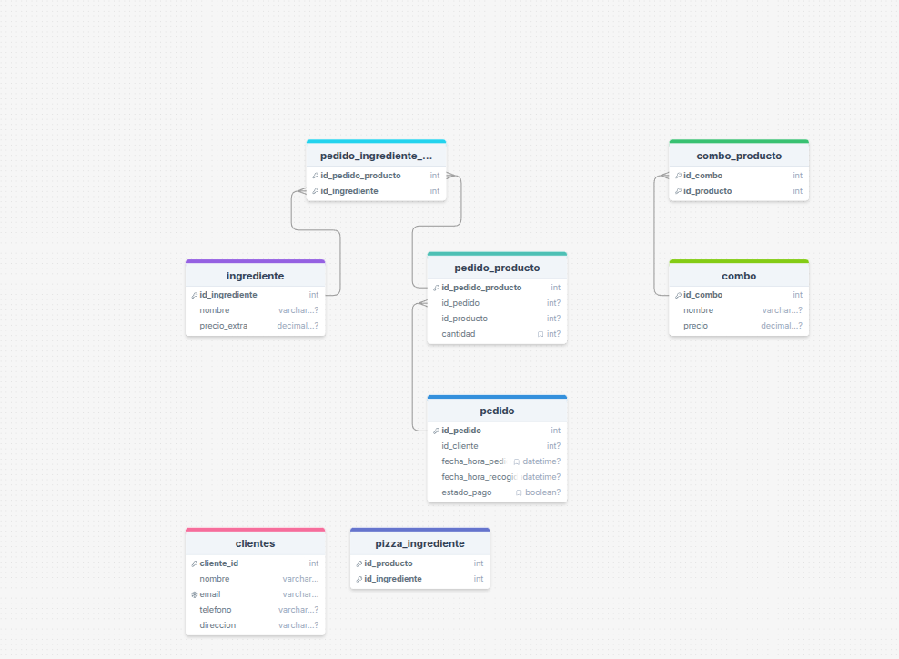

(4H) Pizza Fiesta

La pizzería "Pizza Fiesta" requiere el desarrollo de una base de datos para gestionar de manera eficiente sus operaciones diarias. El sistema debe permitir el registro y manejo de clientes, productos (pizzas, bebidas e ingredientes), y pedidos. A su vez, la base de datos debe controlar los ingredientes utilizados en cada pizza, así como manejar los precios para pizzas de distintos tamaños (pequeñas, medianas y grandes), tanto individuales como enteras. Adicionalmente, el sistema debe gestionar el pago y la recogida de los pedidos, asegurando que los pedidos se preparen solo una vez confirmado el pago.

Problema:
Actualmente, "Pizza Fiesta" no tiene una forma eficaz de gestionar sus operaciones, lo que genera dificultades en el seguimiento de pedidos, el control de inventario de ingredientes y el manejo de precios según el tipo de pizza y tamaño. Además, los clientes no tienen la posibilidad de personalizar su pedido de manera clara, lo que afecta la experiencia del usuario. La pizzería necesita una solución que automatice estas tareas y facilite la gestión de los pedidos y el inventario de productos.

Características Principales:
Gestión de Clientes: El sistema debe permitir el registro de información detallada de los clientes, incluyendo nombre, número de contacto y dirección.
Gestión de Productos:
Registro de pizzas disponibles (pequeñas, medianas y grandes) y bebidas.
Gestión de ingredientes, permitiendo la personalización de pizzas por parte de los clientes.
Control de combos que incluyan pizzas y bebidas.
Gestión de Pedidos:
Los clientes podrán realizar pedidos que se procesarán tras el pago.
La hora de recogida debe ser indicada por el cliente al hacer el pedido.
Posibilidad de añadir ingredientes extra, aplicando un costo adicional.
Detallado del Pedido:
El sistema debe detallar el proceso de preparación de cada pizza, permitiendo al cliente seleccionar los ingredientes disponibles para personalizar su pizza.
Visualización de costos según el tamaño de la pizza y los ingredientes añadidos.
Pagos y Recogida: Los pedidos solo comenzarán a prepararse una vez realizado el pago, sin costos adicionales, ya que los clientes recogen personalmente su orden.


Resultado esperado

Entregables
Archivo SQL de la Estructura: Este archivo contendrá la definición completa de la base de datos, incluyendo la creación de todas las tablas, así como las claves primarias y foráneas necesarias para mantener la integridad referencial. Se asegurará que la estructura sea implementable en un entorno MySQL.
Archivo SQL de los Datos: Este archivo incluirá los scripts para insertar datos de prueba en las tablas creadas previamente. Los datos deberán representar escenarios realistas que permitan validar el funcionamiento del sistema, incluyendo información sobre médicos, empleados y pacientes.
README: Este documento proporcionará una descripción general del proyecto, incluyendo instrucciones sobre cómo ejecutar los archivos SQL en un entorno MySQL. Además, incluirá soluciones a las consultas SQL planteadas en el proyecto, explicando la lógica detrás de cada consulta y cómo se relaciona con la estructura de la base de datos. Esto asegurará que los evaluadores comprendan la funcionalidad del sistema y puedan verificar la correcta implementación de las consultas.
Requisitos del Modelo Lógico y Físico:
El modelo lógico debe reflejar correctamente las entidades, relaciones, atributos y cardinalidades.
El modelo físico debe ser implementable en una base de datos MySQL, reflejando correctamente las estructuras de tablas, claves primarias y foráneas.
Evidencia fotográfica o uso de plataformas como drawSQL o StarUML debe ser proporcionada, ya sea en forma de capturas de pantalla o enlaces a los diagramas.


# Consultas


1. **Registrar un nuevo cliente:**


```sql


```


2. **Agregar un nuevo producto (pizza) al menú:**


```sql


```


3. **Registrar una bebida en el menú:**


```sql


```


4. **Agregar un ingrediente a la base de datos:**


```sql


```


5. **Crear un pedido para un cliente:**


```sql


```


6. **Añadir productos a un pedido específico:**


```sql


```


7. **Añadir ingredientes adicionales a una pizza en un pedido:**


```sql


```


8. **Consultar el detalle de un pedido (productos y sus ingredientes):**


```sql


```


9. **Actualizar el precio de una pizza en el menú:**


```sql


```


10. **Actualizar la dirección de un cliente:**


```sql


```


11. **Eliminar un producto del menú (bebida):**


```sql


```


12. **Eliminar un ingrediente de la base de datos:**


```sql


```


13. **Consultar todos los pedidos de un cliente:**


```sql


```


14. **Listar todos los productos disponibles en el menú (pizzas y bebidas):**


```sql


```


15. **Listar todos los ingredientes disponibles para personalizar una pizza:**


```sql


```


16. **Calcular el costo total de un pedido (incluyendo ingredientes adicionales):**


```sql


```


17. **Listar los clientes que han hecho más de 5 pedidos:**


```sql


```


18. **Buscar pedidos programados para recogerse después de una hora específica:**


```sql


```


19. **Listar todos los combos de pizzas con bebidas disponibles en el menú:**


```sql


```


20. **Buscar pizzas con un precio mayor a $100:**


```sql


```


21. calcular el total de ingresos por día, semana y mes. 


**Ingresos por Día:**


```sql


```


**Ingresos por Semana:**


```sql


```


**Ingresos por Mes:**


```sql


```

